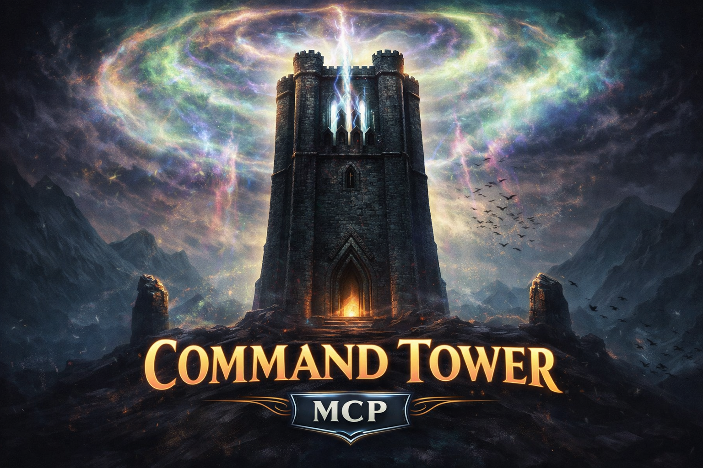

# Command Tower MCP



*When the brew grows cold and cuts are hard, all eyes look in one direction.*

An MCP server for Magic: The Gathering deck building. Create, read, and update your decks on Archidekt. Search for cards with Scryfall. Let AI help you brew.


## Tools

| Tool | Description |
|------|-------------|
| `create_deck` | Create a new deck (Archidekt) |
| `list_decks` | List all decks in your account (Archidekt) |
| `read_deck` | Read deck contents with card counts (Archidekt) |
| `update_deck` | Add/remove cards from a deck (Archidekt) |
| `lookup_cards` | Look up cards by name, bulk up to 150 (Scryfall) |
| `search_cards` | Search with query syntax, filters, pagination (Scryfall) |


## Example Prompt

> There are some cool changelings in the new Lorwyn set. Update my changeling tribal deck.

**Result:**

> I'll help you update your changeling tribal deck with cards from Lorwyn. Let me first check your current deck and then search for Lorwyn changelings.
> 
> `[C] list_decks`
> 
> ...
> 
> Finished! 
> Please check your deck at: https://archidekt.com/decks/19334189

## Setup

### 1. Clone and install

```bash
git clone https://github.com/yourusername/command-tower-mcp.git
cd command-tower-mcp
npm install
```

### 2. Add to Claude Desktop

Edit `~/Library/Application Support/Claude/claude_desktop_config.json`:

```json
{
  "mcpServers": {
    "command-tower": {
      "command": "node",
      "args": ["/absolute/path/to/command-tower-mcp/index.js"],
      "env": {
        "ARCHIDEKT_USERNAME": "your_username",
        "ARCHIDEKT_PASSWORD": "your_password"
      }
    }
  }
}
```

Restart Claude Desktop after saving.

## Development

### Test with MCP Inspector

Copy `.env.example` to `.env` and fill in your credentials:

```bash
cp .env.example .env
```

Run the inspector:

```bash
npx @modelcontextprotocol/inspector node index.js
```

## TODO

- [ ] Validate deck legality
- [ ] Integrate with custom card generation

## Disclaimer

This is an unofficial fan-made project and is not affiliated with, endorsed by, or sponsored by Wizards of the Coast, Scryfall, or Archidekt.

But thanks to [Scryfall](https://scryfall.com) and [Archidekt](https://archidekt.com) for their generous API terms that make projects like this possible. See [Scryfall API docs](https://scryfall.com/docs/api) and [Archidekt API terms](https://archidekt.com/forum/thread/40353).
